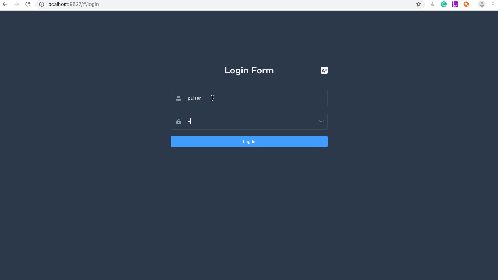

# Apache Pulsar manager

Apache Pulsar manager is a web-based GUI management tool for managing and monitoring Pulsar.

A Pulsar Manager is capable of managing multiple Pulsar clusters. A Pulsar instance or a group
of Pulsar clusters is defined as an `Environment` in Pulsar Manager. You can create as many environments
as you can. The following diagram illustrates the overall architecture of a Pulsar Manager.


A running Pulsar Manager instance is comprised of two components: one is the `frontend` which provides
the GUI to manage and monitor Pulsar clusters, the other one is the `backend` which interacts with Pulsar
clusters for collecting metrics, forwarding admin requests to the requested Pulsar cluster or brokers.

Since Pulsar Manager directly interacts with Pulsar brokers and bookies for management, it is required
to deploy the Pulsar Manager into the same network as your Pulsar clusters. So the Pulsar Manager backend
is able to talk to the brokers and bookies in your Pulsar cluster.

## Install

### Use Docker

1. Start Pulsar standalone.

    ```
    docker pull apachepulsar/pulsar:latest
    docker run -d -it \
        -p 6650:6650 \
        -p 8080:8080 \
        -v pulsardata:/pulsar/data \
        -v pulsarconf:/pulsar/conf \
        --name pulsar-standalone \
        apachepulsar/pulsar:latest \
        bin/pulsar standalone
    ```

2. Start Pulsar Manager in a separate container.

    > NOTE: the command links the pulsar-manager container with the pulsar standalone container so they are in the same network.

    ```
    docker pull apachepulsar/pulsar-manager:v0.2.0
    docker run -it \
        -p 9527:9527 -p 7750:7750 \
        -e SPRING_CONFIGURATION_FILE=/pulsar-manager/pulsar-manager/application.properties \
        --link pulsar-standalone \
        apachepulsar/pulsar-manager:v0.2.0
    ```

    > NOTE: Enable bookkeeper visual manager(Optional), update the field `bkvm.enabled` to `true` for the file [bkvm.conf](https://github.com/apache/pulsar-manager/blob/master/src/main/resources/bkvm.conf).

    ```
    docker pull apachepulsar/pulsar-manager:v0.2.0
    docker run -it \
        -p 9527:9527 -p 7750:7750 \
        -e SPRING_CONFIGURATION_FILE=/pulsar-manager/pulsar-manager/application.properties \
        -v $PWD/bkvm.conf:/pulsar-manager/pulsar-manager/bkvm.conf \
        --link pulsar-standalone \
        apachepulsar/pulsar-manager:v0.2.0
    ```

    * `SPRING_CONFIGURATION_FILE`: Default configuration file for spring.

### Use Docker Compose

Alternatively, you can start a standalone and Pulsar Manager using the docker compose file provided in this repository.

1. Clone this git repoistory.

    ```bash
    https://github.com/apache/pulsar-manager
    ```

2. Go to the docker directory.

    ```bash
    cd docker
    ```

3. Start the docker composed cluster.

    ```bash
    docker-compose up
    ```

### Deploy Pulsar Manager to Kubernetes

The Pulsar Manager can be deployed as part of [Pulsar Helm Chart](https://github.com/apache/pulsar-helm-chart).

1. Install the Pulsar cluster with Pulsar Manager

    ```bash
    helm repo add apache https://pulsar.apache.org/charts
    helm repo update
    helm install <release-name> apache/pulsar
    ```

2. Access the Pulsar Manager.

    The default values will create a `ClusterIP` for the Pulsar Manager you can use to interact with cluster.
    To find the IP address of the Pulsar Manager, use the following command:
    ```bash
    kubectl get service -n <k8s-namespace>
    ```
    After find the ip address of the Pulsar Manager, you can access the Pulsar Manager at `http://${pulsar-manager-cluster-ip}/#/environments`.

### Deploy from bin package

```
wget https://dist.apache.org/repos/dist/release/pulsar/pulsar-manager/pulsar-manager-0.2.0/apache-pulsar-manager-0.2.0-bin.tar.gz
tar -zxvf apache-pulsar-manager-0.2.0-bin.tar.gz
cd pulsar-manager
tar -xvf pulsar-manager.tar
cd pulsar-manager
cp -r ../dist ui
./bin/pulsar-manager
```

Now, you can access it at the following address: frontend => http://localhost:7750/ui/index.html.

For details, see [Set the administrator account and password](#access-pulsar-manager).

#### Enable BookKeeper visual manager(optional)

Update the configuration file `pulsar-manager/bkvm.conf`, and set `bkvm.enabled` to `true`.

bkvm address => http://localhost:7750/bkvm

### Build from source code

#### Prerequisites

* Java JDK 1.8
* Node 10.15.3 or later
* Npm 6.4.1 or later
* Pulsar 2.4.0 or later

#### Build instructions

1. Clone the source code.

    ``` bash
    git clone https://github.com/apache/pulsar-manager
    ```

2. Build and start the backend.
    
    ```
    cd pulsar-manager
    ./gradlew build -x test
    cd build/distributions
    unzip pulsar-manager.zip or tar -zxvf pulsar-manager.tar
    ./pulsar-manager/bin/pulsar-manager
    ```

3. Open a new terminal, build and start the front end.

    ```
    cd pulsar-manager/front-end
    npm install --save
    npm run dev
    ```

After running these steps, the Pulsar Manager is running locally at http://127.0.0.1:9527/#/environments.

## Access Pulsar Manager

1. Access Pulsar manager UI at `http://${frontend-end-ip}/#/environments`.

    If you started Pulsar Manager using docker or docker-compose, the Pulsar Manager is running at port 9527. You can access the Pulsar Manager UI at http://127.0.0.1:9527/#/environments.

    If you are deploying Pulsar Manager 0.1.0 using the released container, you can log in the Pulsar Manager UI using the following credentials.

    * Account: `pulsar`  
    * Password: `pulsar`  

    If you are deploying Pulsar Manager using the latest code, you can create a super-user using the following command. Then you can use the super user credentials to log in the Pulsar Manager UI.

    ```
    CSRF_TOKEN=$(curl http://backend-service:7750/pulsar-manager/csrf-token)
    curl \
        -H "X-XSRF-TOKEN: $CSRF_TOKEN" \
        -H "Cookie: XSRF-TOKEN=$CSRF_TOKEN;" \
        -H 'Content-Type: application/json' \
        -X PUT http://backend-service:7750/pulsar-manager/users/superuser \
        -d '{"name": "admin", "password": "apachepulsar", "description": "test", "email": "username@test.org"}'
    ```

    * `backend-service`: The IP address or domain name of the backend service.
    * `password`: The password should be more than or equal to 6 digits.

2. Create an environment. 

    An environment represents a Pulsar instance or a group of clusters you want to manage. A Pulsar Manager is capable of managing multiple environments.

    - Click "New Environment" button to add an environment.
    - Input the "Environment Name". The environment name is used for identifying an environment.
    - Input the "Service URL". The Service URL is the admin service url of your Pulsar cluster.
        - You need to make sure the service url that Pulsar Manager is able to access. In this example, both pulsar container and pulsar-manager container are linked. So you can use pulsar container name as the domain name of the pulsar standalone cluster. Thus you can type `http://pulsar-standalone:8080`.
    - Input the "Bookie URL". In this example, you can type `http://pulsar-standalone:6650`

## Configure Pulsar Manager

### Back end

For more information about the back end, see [pulsar-manager-backend](https://github.com/apache/pulsar-manager/blob/master/src/README.md).

### Front end

For more information about the front end, see [pulsar-manager-frontend](https://github.com/apache/pulsar-manager/blob/master/front-end/README.md).

## Features

* Tenants Management
* Namespaces Management
* Topics Management
* Subscriptions Management
* Brokers Management
* Clusters Management
* Dynamic environments with multiple changes
* Support JWT Auth

### Log in

Use the default account (`pulsar`) and the default password (`pulsar`) to log in.



### Configure environment

The puslar-manager supports multiple environment configurations and can manage multiple environments conveniently. 

Here, the service URL represents the service IP address of the broker. If you run Pulsar manager in the standalone mode, it should be set to "http://127.0.0.1:8080".
You can easily find it in the client.conf file of your pulsar-manager. 

And the bookie URL represents the service IP address of the bookkeeper. If you run Pulsar manager in the standalone mode, it should be set to "http://127.0.0.1:6650". 


### Manage tenants


### Manage namespaces


### Manage topics


### Manage subscriptions


### Manage clusters


### Manage brokers


### Topics monitoring

The pulsar-manager can monitor topics and subscriptions.


### Manage token


## Development

### Default Test database HerdDB

#### Introduction

Pulsar Manager bundles JDBC Drivers for [HerdDB](https://github.com/diennea/herddb).
The default configuration starts and embedded in-memory only HerdDB database.

HerdDB can be used in production, you just have to use the  correct JDBC URL.
Follow the instructions in [application.properties](https://github.com/apache/pulsar-manager/blob/master/src/main/resources/application.properties) to switch the connection to a standalone HerdDB service or cluster.

The JDBC URL will look like this:
jdbc:herddb:server:localhost:7000

In cluster mode HerdDB uses Apache BookKeeper and Apache ZooKeeper to store data and metadata, you can share your ZooKeeper cluster and the Bookies bundled with Pulsar.

The JDBC URL will look like this:
jdbc:herddb:zookeeper:localhost:2181/herddb

In order to start and setup an HerdDB database follow the instructions on the [HerdDB documentation](https://github.com/diennea/herddb/wiki).
