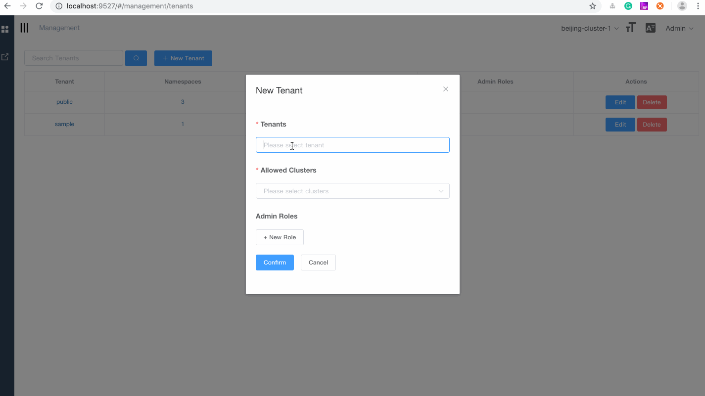
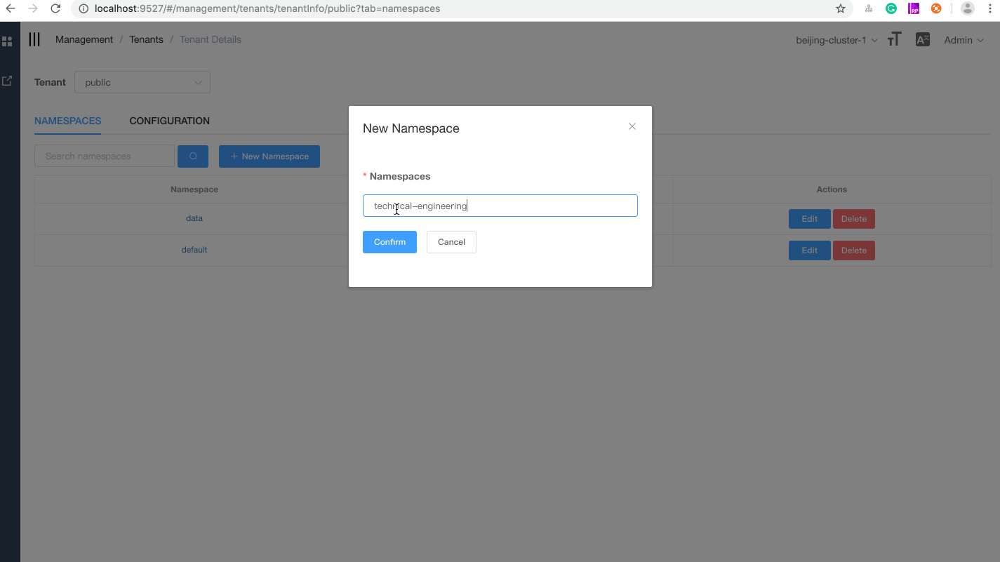
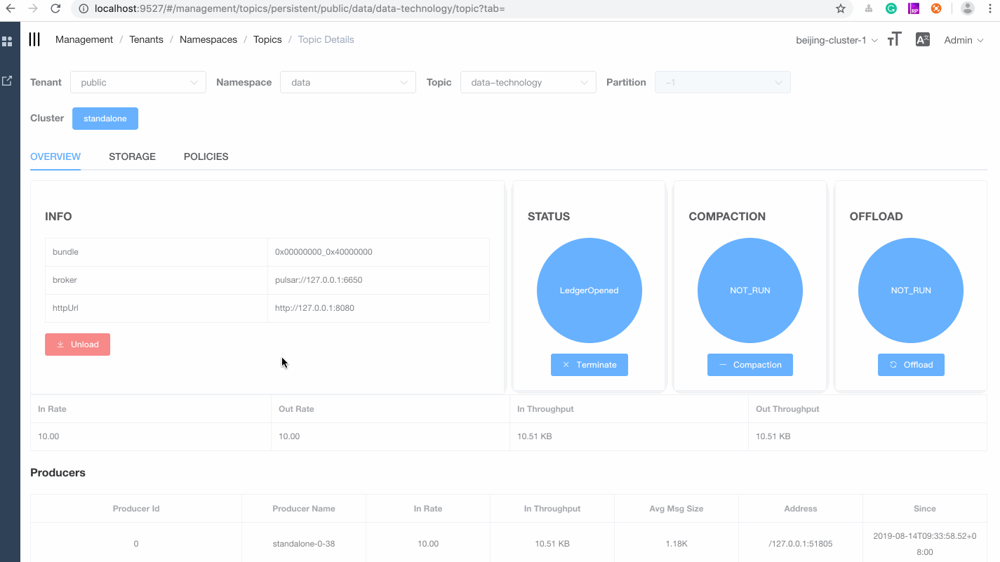

## Pulsar Admin Manager

Front end is based on [vue-element-admin](https://panjiachen.github.io/vue-element-admin/#/dashboard).
Back end is based on [spring boot](https://github.com/spring-projects/spring-boot).

### Main features

* Tenants Management
* Namespaces Management
* Topics Management
* Subscriptions Management
* Brokers Management
* Clusters Management
* Multi environment dynamic change

### Feature preview

#### Login

Open your browser and use the account and the password to access the following address.
username: pulsar
password: pulsar
http://frond-end-ip:9527/


#### Configuration environment

The puslar-manager supports multi-environment configuration and can conveniently manage multiple environments.


#### Manage tenants




#### Manage namespaces



#### Manage topics


#### Manage subscriptions


#### Manage clusters and brokers


#### Topics monitoring

The pulsar-manager can do some simple monitoring on topics and subscriptions.




### Prerequisites
* Java 8 or later
* Node 10.15.3 or later
* Npm 6.4.1 or later
* Pulsar 2.4.0 or later
* Docker

### Preparations

#### Start Pulsar standalone

```
docker pull apachepulsar/pulsar:2.4.0
docker run -d -it -p 6650:6650 -p 8080:8080 -v $PWD/data:/pulsar/data --name pulsar-manager-standalone apachepulsar/pulsar:2.4.0 bin/pulsar standalone
```

### Build Environment with Docker

#### Download source code

```
git clone https://github.com/streamnative/pulsar-manager
```

#### Build and start backend
```
cd pulsar-manager
./gradlew build -x test
java -jar ./build/libs/pulsar-manager.jar
```

#### Build and start front end

```
cd pulsar-manager/front-end
npm install --save
npm run dev
```

### Build Environment with local

```
docker pull streamnative/pulsar-manager
docker run -it  -p 9527:9527 -e REDIRECT_HOST=front-end-ip -e REDIRECT_PORT=front-end-port streamnative/pulsar-manager
```
* REDIRECT_HOST: This parameter represents the ip address of the front-end server.
* REDIRECT_PORT: This parameter represents the ip port of the front-end server.

### Open your browser and use the account and the password to access the following address.
username: pulsar
password: pulsar
http://localhost:9527/


### Back end
Back end is based on [spring boot](https://github.com/spring-projects/spring-boot).


### Front end

[front-end-deploy](https://github.com/streamnative/pulsar-manager/blob/master/front-end/README.md)
