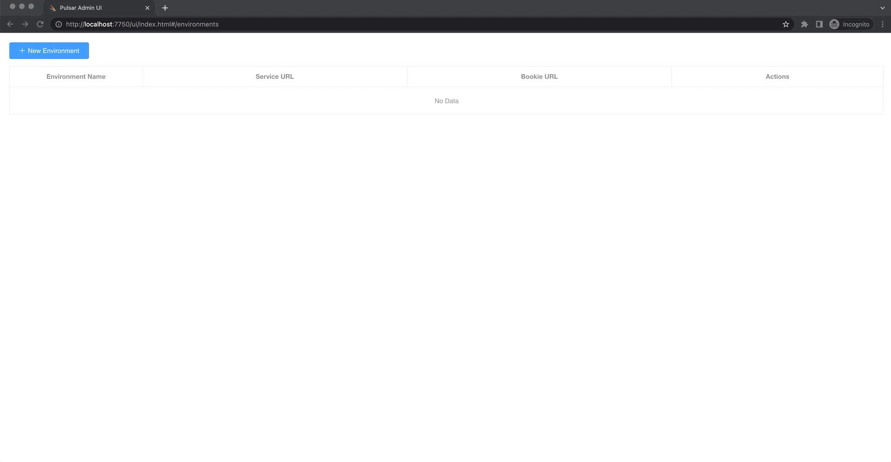
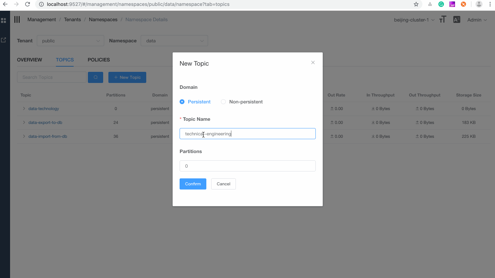

# Apache Pulsar manager

Apache Pulsar manager is a web-based GUI management tool for managing and monitoring Pulsar.

## Feature

* Tenants Management
* Namespaces Management
* Topics Management
* Subscriptions Management
* Brokers Management
* Clusters Management
* Dynamic environments with multiple changes
* Support JWT Auth

## Feature preview

### Log in

Use the default account (`pulsar`) and the default password (`pulsar`) to log in.


### Configure environment

The puslar-manager supports multiple environment configurations and can manage multiple environments conveniently. 



### Manage tenants


### Manage namespaces


### Manage topics




### Manage subscriptions


### Manage clusters


### Manage brokers


### Topics monitoring

The pulsar-manager can monitor topics and subscriptions.


### Manage token


## Prerequisites
* Java JDK 1.8
* Node 10.15.3 or later
* Npm 6.4.1 or later
* Pulsar 2.4.0 or later
* Docker

## Preparation

1. Start Pulsar standalone.

    ```
    docker pull apachepulsar/pulsar:2.4.0
    docker run -d -it -p 6650:6650 -p 8080:8080 -v $PWD/data:/pulsar/data --name pulsar-manager-standalone apachepulsar/pulsar:2.4.0 bin/pulsar standalone
    ```

2. Build an environment. 

    You can **build an environment with Docker** or **build a local environment**.

   * Build an environment with Docker

        * `REDIRECT_HOST`: the IP address of the front-end server.
            
        * `REDIRECT_PORT`: the port of the front-end server.

        * `DRIVER_CLASS_NAME`: the driver class name of PostgreSQL.

        * `URL`: the url of PostgreSQL jdbc, example: jdbc:postgresql://127.0.0.1:5432/pulsar_manager.

        * `USERNAME`: the username of PostgreSQL.

        * `PASSWORD`: the password of PostgreSQL.

        * `LOG_LEVEL`: level of log.

        ```
        docker pull apachepulsar/pulsar-manager
        docker run -it -p 9527:9527 -e REDIRECT_HOST=front-end-ip -e REDIRECT_PORT=front-end-port -e DRIVER_CLASS_NAME=org.postgresql.Driver -e URL='jdbc-url' -e USERNAME=root -e PASSWORD=pulsar -e LOG_LEVEL=DEBUG apachepulsar/pulsar-manager /bin/sh
        ```

        This is an example:
        
        ```
	    docker pull apachepulsar/pulsar-manager:v0.1.0
        docker run -it -p 9527:9527 -e REDIRECT_HOST=http://192.168.0.104 -e REDIRECT_PORT=9527 -e DRIVER_CLASS_NAME=org.postgresql.Driver -e URL='jdbc:postgresql://127.0.0.1:5432/pulsar_manager' -e USERNAME=pulsar -e PASSWORD=pulsar -e LOG_LEVEL=DEBUG -v $PWD:/data apachepulsar/pulsar-manager:v0.1.0 /bin/sh
        ```

   * Build a local environment

        (1) Download the source code.

        ```
        git clone https://github.com/apache/pulsar-manager
        ```

        (2) Build and start the backend.
        
        ```
        cd pulsar-manager
        ./gradlew build -x test
        cd build/distributions
        unzip pulsar-manager.zip or tar -zxvf pulsar-manager.tar
        ./pulsar-manager/bin/pulsar-manager
        ```

        (3) Build and start the front end.

        ```
        cd pulsar-manager/front-end
        npm install --save
        npm run dev
        ```

3. Access Pulsar manager website.

If you use the container to build the environment, please log in directly using the the account and the password to log in to the Pulsar manager website as below.

   * Account: `pulsar`  
   * Password: `pulsar`  
   
if you use the latest code to deploy the environment yourself, please use the following command to initialize the superuser and password

    ```$xslt
    curl -H "Content-Type: application/json" -X PUT http://localhost:7750/pulsar-manager/users/superuser -d '{"name": "admin", "password": "apachepulsar", "description": "test", "email": "username@test.org"}'
    ```

   * Pulsar manager website: http://localhost:9527/


### Default Test database HerdDB

#### Introduction

Pulsar Manager bundles JDBC Drivers for [HerdDB](https://github.com/diennea/herddb).
The default configuration starts and embedded in-memory only HerdDB database.

HerdDB can be used in production, you just have to use the  correct JDBC URL.
Follow the instructions in [application.properties](https://github.com/apache/pulsar-manager/blob/master/src/main/resources/application.properties) to switch the connection to a standalone HerdDB service or cluster.

The JDBC URL will look like this:
jdbc:herddb:server:localhost:7000

In cluster mode HerdDB uses Apache BookKeeper and Apache ZooKeeper to store data and metadata, you can share your ZooKeeper cluster and the Bookies bundled with Pulsar.

The JDBC URL will look like this:
jdbc:herddb:zookeeper:localhost:2181/herddb

In order to start and setup an HerdDB database follow the instructions on the [HerdDB documentation](https://github.com/diennea/herddb/wiki).

## Back end

For more information about the back end, see [pulsar-manager-backend](https://github.com/apache/pulsar-manager/blob/master/src/README.md).


## Front end

For more information about the front end, see [pulsar-manager-frontend](https://github.com/apache/pulsar-manager/blob/master/front-end/README.md).

