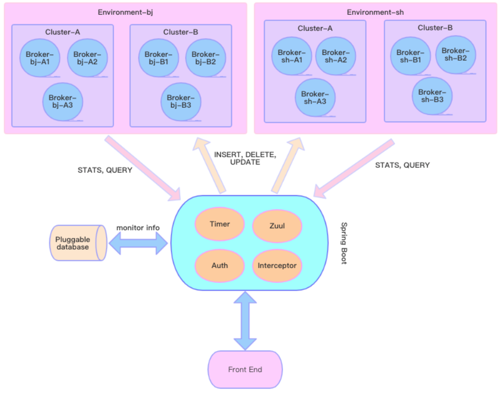
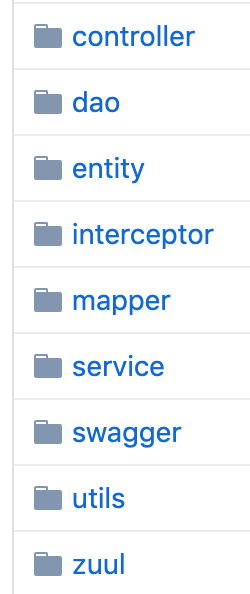
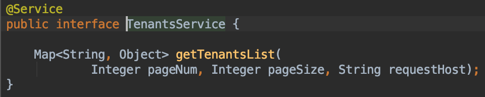
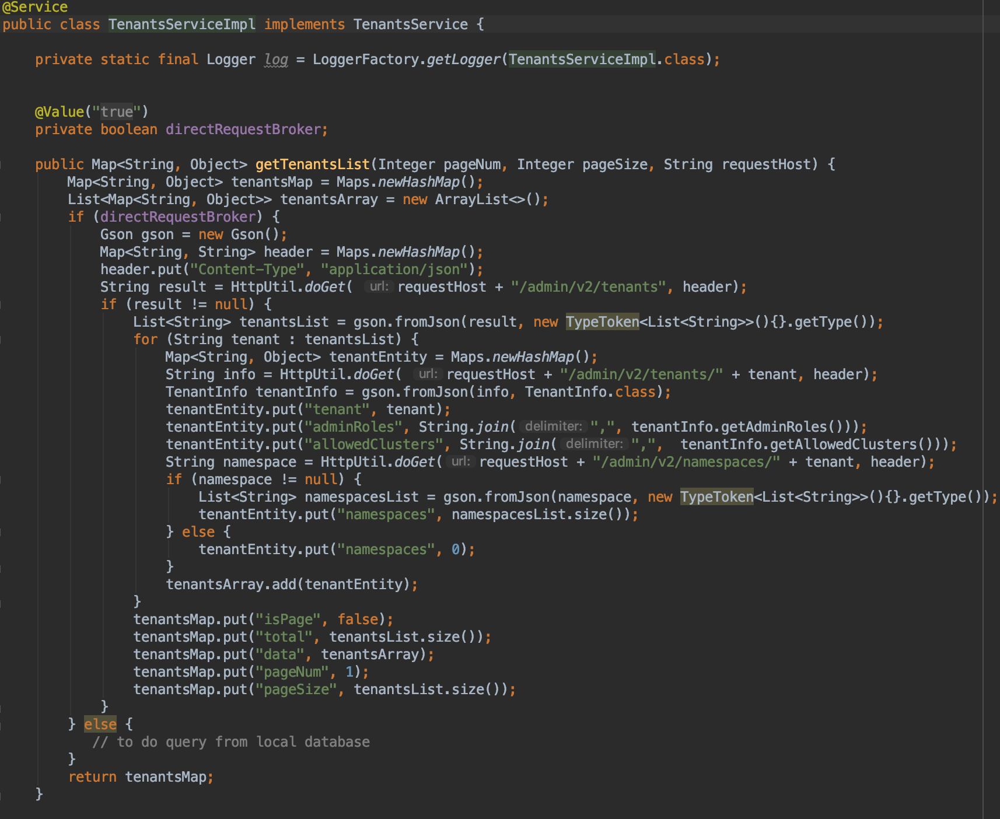
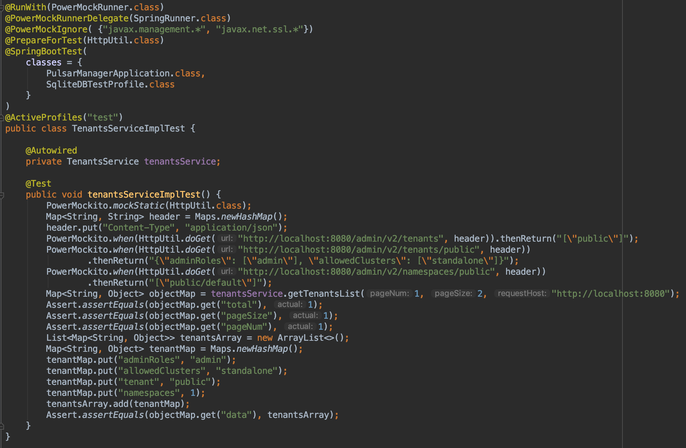
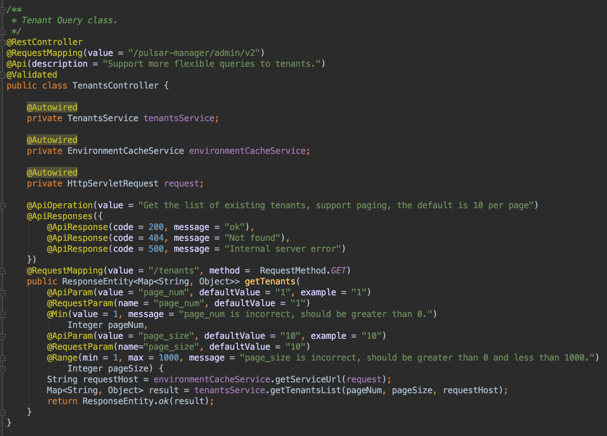
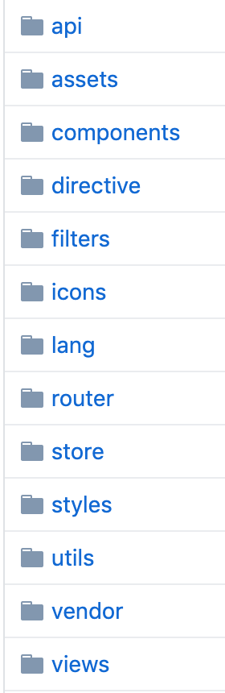
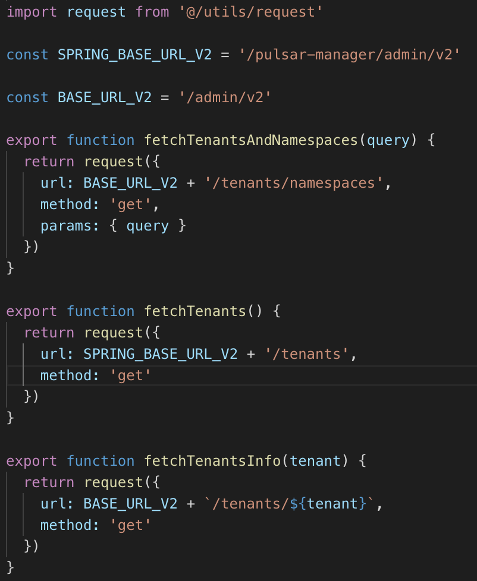

# Pulsar Manager Developer's Guide

Pulsar Manager is a web-based GUI management and monitoring tool that helps administrators and users manage and monitor tenants, namespaces, topics, subscriptions, brokers, clusters, and so on, and supports dynamic configuration of multiple environments.



The figure above illustrates how does Pulsar Manager work and how it manages multiple Pulsar environments. The Pulsar Manager comprises two parts: frontend and backend.

## Backend

Development tools used in the backend are listed below:

* Spring-boot 
* Mybatis
* PageHelper
* Swagger2
* Zuul

The code structure of the backend is shown below.



* The backend configuration file is [here](https://github.com/apache/pulsar-manager/blob/master/src/main/resources/application.properties).
* The database schema is defined [here](https://github.com/apache/pulsar-manager/blob/master/src/main/resources/META-INF/sql/mysql-schema.sql)

### Add new RESTful API

Restful API defines the specification. If the RESTful API needs backend processing, it needs to be prefixed with pulsar-manager. If you want to directly forward the request to the broker, you can directly define it according to the specification of Pulsar RESTful API.

Let's take a new tenant as an example to illustrate how to develop the Pulsar Manager project.

1. Define a RESTful API.  

Restful API that requires backend processing  

* List all tenants

```
GET /pulsar-manager/admin/v2/tenants
```

Restful API directly forwarded to a broker

* Add a new tenant

```
PUT /admin/v2/tenants/{tenantName}
```

2. Define a service interface.

Service is used to implement business logic and add interface.
Here, the `TenantsService` interface is added under the service folder.



3. Implement a service interface.

Here, aggregate data queried from brokers.



4. Add a test under the test folder, mock data and verify results.



5. Develop RESTful features.

Add a `TenantsController` file under the controller folder to add an API to obtain the tenant list.
In the following class you can add some description information, error response, etc.



## Frontend

The frontend is developed based on [vue-element-admi](https://panjiachen.github.io/vue-element-admin-site/guide/) and [Element](https://element.eleme.cn/#/en-US).
The development of the frontend is [here](https://github.com/apache/pulsar-manager/tree/master/front-end/src/views/management).



The frontend code structure is shown as above.
* api: code of RESTful API icons
* router: code of frontend routings
* lang: code of multiple languages
* views: code of front pages

### Develop a page

1. Add a RESTful API interface.

The RESTful interface is defined in the `api` folder. 




2. Add a new page.

Add a new page [here](https://github.com/apache/pulsar-manager/tree/master/front-end/src/views/management). 
For example, [this](https://github.com/apache/pulsar-manager/blob/master/front-end/src/views/management/tenants/index.vue) is a tenant page. )

3. Localization

You can add  multiple languages to the corresponding configuration folder under the `lang` folder.
