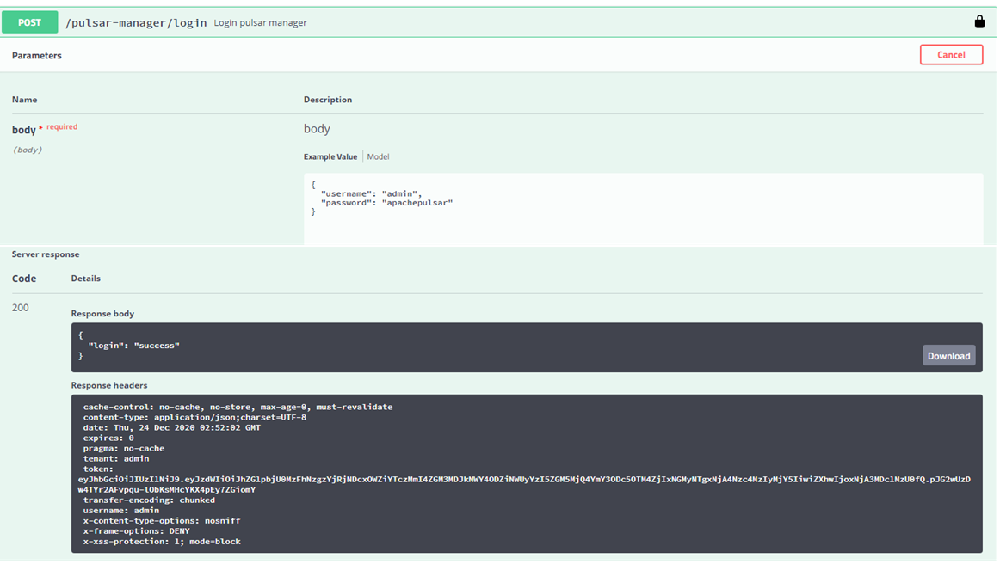
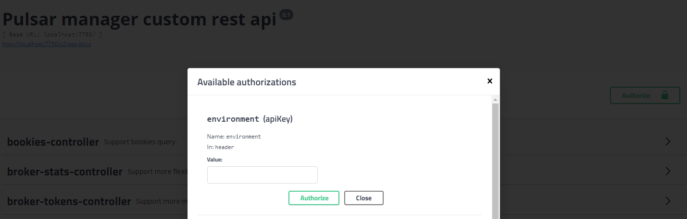

# Pulsar manager backend

Pulsar manager backend is a supplement and improvement to Pulsar broker.

* Handle complex query requests
* Route requests (add, delete, update) to brokers
* Support multi broker, dynamic change environment

### Supported configurations of backend 

| Name | Default |Description
| ------- | ------- | ------- |
| `server.port` | 7750 | Port of backend service |
| `pulsar-manager.account` | pulsar | Login account |
| `pulsar-manager.password` | pulsar | Login password |
| `redirect.host` | localhost | IP address of front-end service |
| `redirect.port` | 9527 | Port of front-end service |
| `insert.stats.interval` | 30000ms | Time interval for collecting statistical information |
| `clear.stats.interval` | 300000ms | Time interval for cleaning statistics |

### How to set parameters when starting back-end services

```
./build/distributions/pulsar-manager/bin/pulsar-manager --redirect.host=http://localhost --redirect.port=9527 insert.stats.interval=600000
```

### Use custom databases

If you have a large amount of data, you can use a custom database. The following is an example of PostgreSQL.   

1. Initialize database and table structures using [file](https://github.com/apache/pulsar-manager/tree/master/src/main/resources/META-INF/sql/postgresql-schema.sql).

2. Modify the [configuration file](https://github.com/apache/pulsar-manager/blob/master/src/main/resources/application.properties) and add PostgreSQL configuration

```
spring.datasource.driver-class-name=org.postgresql.Driver
spring.datasource.url=jdbc:postgresql://127.0.0.1:5432/pulsar_manager
spring.datasource.username=postgres
spring.datasource.password=postgres
```

3. Compile to generate a new executable jar package

```
./gradlew build -x test
```

### Enable Https forward

First, please get the client certificate file for connecting to your Pulsar cluster. Please check out this [document](http://pulsar.apache.org/docs/en/security-tls-transport/) on how to create the client certificate file for Pulsar clients. Assume your client certificate is stored in `certs/ca.cert.pem`.

Secondly, following the instructions below to generate a keystore file to be used by Pulsar Manager. Please replace `[/path/to/client/certs]` with the path to your client certificate file.

```$xslt
keytool -import -trustcacerts -keystore keystore-file -alias test-keystore -file [/path/to/client/certs]
```

Thirdly, configure Pulsar Manager to enable TLS by adding the following configuration settings.

```$xslt
tls.enabled=false
tls.keystore=keystore-file
tls.keystore.password=keystore-file-password
tls.hostname.verifier=false
```

| Name | Default |Description
| ------- | ------- | ------- |
| tls.enabled | false | If broker enable tls configuration, set to true, otherwise set to false |
| tls.keystore | "" | Keystore file path, need to use tool keytool to convert pem file to b file |
| tls.keystore.password | "" | Keystore file password |
| tls.hostname.verifier | false | Turn on hostname check, default false to test |

### Enable peek message

If you want to enable feature `peek-message`, please set the following option to true in file `application.properties`.

```$xslt
pulsar.peek.message=true
```

If your Pulsar cluster enable TLS, you also need to add the path of the ca certificate for option `tls.pulsar.admin.ca-certs` in file `application.properties`.

```$xslt
tls.pulsar.admin.ca-certs=ca-client-path
```

### Enable JWT Auth

If you want to turn on JWT authentication, configure the following parameters:

* backend.jwt.token  token for the superuser. You need to configure this parameter during cluster initialization.
* jwt.broker.token.mode  Two modes of generating token, SECRET and PRIVATE.
* jwt.broker.public.key Configure this option if you are using the PRIVATE mode.
* jwt.broker.private.key Configure this option if you are using the PRIVATE mode.
* jwt.broker.secret.key Configure this option if you are using the SECRET mode.

For more information, see [Apache Pulsar](http://pulsar.apache.org/docs/en/security-token-admin/)

* Method 1: Use command-line tool

```
./build/distributions/pulsar-manager/bin/pulsar-manager --redirect.host=http://localhost --redirect.port=9527 insert.stats.interval=600000 --backend.jwt.token=token --jwt.broker.token.mode=PRIVATE --jwt.broker.private.key=file:///path/broker-private.key --jwt.broker.public.key=file:///path/broker-public.key
```

* Method 2. Configure the application.properties file

```
backend.jwt.token=token

jwt.broker.token.mode=PRIVATE
jwt.broker.public.key=file:///path/broker-public.key
jwt.broker.private.key=file:///path/broker-private.key

or 
jwt.broker.token.mode=SECRET
jwt.broker.secret.key=file:///path/broker-secret.key
```

* Method 3: Use Docker only use token.

```
export JWT_TOKEN="your-token"
docker run -it -p 9527:9527 -p 7750:7750 -e REDIRECT_HOST=http://localhost -e REDIRECT_PORT=9527 -e DRIVER_CLASS_NAME=org.postgresql.Driver -e URL='jdbc:postgresql://127.0.0.1:5432/pulsar_manager' -e USERNAME=pulsar -e PASSWORD=pulsar -e LOG_LEVEL=DEBUG -e JWT_TOKEN=$JWT_TOKEN -v $PWD:/data apachepulsar/pulsar-manager:v0.2.0 /bin/sh
```

* `JWT_TOKEN`: the token of superuser configured for the broker. It is generated by the `bin/pulsar tokens create --secret-key` or `bin/pulsar tokens create --private-key` command.
* `REDIRECT_HOST`: the IP address of the front-end server.
* `REDIRECT_PORT`: the port of the front-end server.
* `DRIVER_CLASS_NAME`: the driver class name of the PostgreSQL database.
* `URL`: the JDBC URL of your PostgreSQL database, such as jdbc:postgresql://127.0.0.1:5432/pulsar_manager. The docker image automatically start a local instance of the PostgresSQL database.
* `USERNAME`: the username of PostgreSQL.
* `PASSWORD`: the password of PostgreSQL.
* `LOG_LEVEL`: the level of log.

* Method 4: Use Docker with token, public key and private key.

```
export JWT_TOKEN="your-token"
export PRIVATE_KEY="file:///pulsar-manager/secret/my-private.key"
export PUBLIC_KEY="file:///pulsar-manager/secret/my-public.key"
docker run -it -p 9527:9527 -p 7750:7750 -e REDIRECT_HOST=http://localhost -e REDIRECT_PORT=9527 -e DRIVER_CLASS_NAME=org.postgresql.Driver -e URL='jdbc:postgresql://127.0.0.1:5432/pulsar_manager' -e USERNAME=pulsar -e PASSWORD=pulsar -e LOG_LEVEL=DEBUG -e JWT_TOKEN=$JWT_TOKEN -e PRIVATE_KEY=$PRIVATE_KEY -e PUBLIC_KEY=$PUBLIC_KEY -v $PWD:/data -v $PWD/secret:/pulsar-manager/secret apachepulsar/pulsar-manager:v0.2.0 /bin/sh
```

* `JWT_TOKEN`: the token of superuser configured for the broker. It is generated by the by `bin/pulsar tokens create --private-key` command.
* `PRIVATE_KEY`: private key path mounted in container. It is generated by the `bin/pulsar tokens create-key-pair` command.
* `PUBLIC_KEY`: public key path mounted in container. It is generated by the `bin/pulsar tokens create-key-pair` command.
* `$PWD/secret`: the folder where the generated private key and public key are placed locally.
* `REDIRECT_HOST`: the IP address of the front-end server.
* `REDIRECT_PORT`: the port of the front-end server.
* `DRIVER_CLASS_NAME`: the driver class name of the PostgreSQL database.
* `URL`: the JDBC URL of your PostgreSQL database, such as jdbc:postgresql://127.0.0.1:5432/pulsar_manager. A local instance of the PostgresSQL database can be automatically started by the docker image.
* `USERNAME`: the username of PostgreSQL.
* `PASSWORD`: the password of PostgreSQL.
* `LOG_LEVEL`: the level of log.

* Method 5: Use Docker with token, secret key.

```
export JWT_TOKEN="your-token"
export SECRET_KEY="file:///pulsar-manager/secret/my-secret.key"
docker run -it -p 9527:9527 -p 7750:7750 -e REDIRECT_HOST=http://localhost -e REDIRECT_PORT=9527 -e DRIVER_CLASS_NAME=org.postgresql.Driver -e URL='jdbc:postgresql://127.0.0.1:5432/pulsar_manager' -e USERNAME=pulsar -e PASSWORD=pulsar -e LOG_LEVEL=DEBUG -e JWT_TOKEN=$JWT_TOKEN -e SECRET_KEY=$SECRET_KEY -v $PWD:/data -v $PWD/secret:/pulsar-manager/secret apachepulsar/pulsar-manager:v0.2.0 /bin/sh
```

* `JWT_TOKEN`: the token of superuser configured for the broker. It is generated by the by `bin/pulsar tokens create --secret-key` command.
* `SECRET_KEY`: secret key path mounted in container, It is generated by the `bin/pulsar tokens create-secret-key` command.
* `$PWD/secret`: the folder where the generated secret key is placed locally.
* `REDIRECT_HOST`: the IP address of the front-end server.
* `REDIRECT_PORT`: the port of the front-end server.
* `DRIVER_CLASS_NAME`: the driver class name of the PostgreSQL database.
* `URL`: the JDBC URL of your PostgreSQL database, such as jdbc:postgresql://127.0.0.1:5432/pulsar_manager. A local instance of the PostgresSQL database can be automatically started by the docker image.
* `USERNAME`: the username of PostgreSQL.
* `PASSWORD`: the password of PostgreSQL.
* `LOG_LEVEL`: the level of log.

### Enable BookKeeper visual manager

Set the `bkvm.enabled` field to `true` in the file [bkvm.conf](https://github.com/apache/pulsar-manager/blob/master/src/main/resources/bkvm.conf).

    ```
    docker pull apachepulsar/pulsar-manager:v0.2.0
    docker run -it \
        -p 9527:9527 -p 7750:7750 \
        -e SPRING_CONFIGURATION_FILE=/pulsar-manager/pulsar-manager/application.properties \
        -v $PWD/bkvm.conf:/pulsar-manager/pulsar-manager/bkvm.conf \
        --link pulsar-standalone \
        apachepulsar/pulsar-manager:v0.2.0
    ```

### Enable swagger UI
To enable swagger UI, set `swagger.enabled=true` in the `application.properties` file. The default value is `true`.

If you want to disable swagger UI in the  production environment, you can set `swagger.enabled=false`.

### How to use swagger to access the API
1. Enable swagger UI by setting 'swagger.enabled=true' in the `application.properties` file.

2. Visit http://YOUR_BACKEND_SERVICE_HOST:7750/swagger-ui.html

3. Request the login API, use the username and password of the Pulsar Manager to login, copy the `token` of the response header.
   
    The request body is as follows:
    ```$xslt
    {
      "username": "admin",
      "password": "apachepulsar"
    }
    ```
    Copy the token of the response header.
    

4. Authorize. Click the `Authorize` button in swagger UI, and then fill in the authorization information of swagger.
     - environment: the environment name you have configured in Pulsar Manager.
     - token: the token you have copied in the previous step.
     - username: the username you login.
    
    

5. Request other APIs.

#### Third party login options

```
# default empty, current options github
third.party.login.option=
```

#### Github login configuration

```
# The client ID you received from GitHub when you registered https://github.com/settings/applications/new.
github.client.id=your-client-id
# The client secret you received from GitHub for your GitHub App.
github.client.secret=your-client-secret
github.oauth.host=https://github.com/login/oauth/access_token
github.user.info=https://api.github.com/user
github.login.host=https://github.com/login/oauth/authorize
github.redirect.host=http://localhost:9527

# Expiration time of token for third party platform, unit second.
# 60 * 60 * 24 * 7
user.access.token.expire=604800
```
